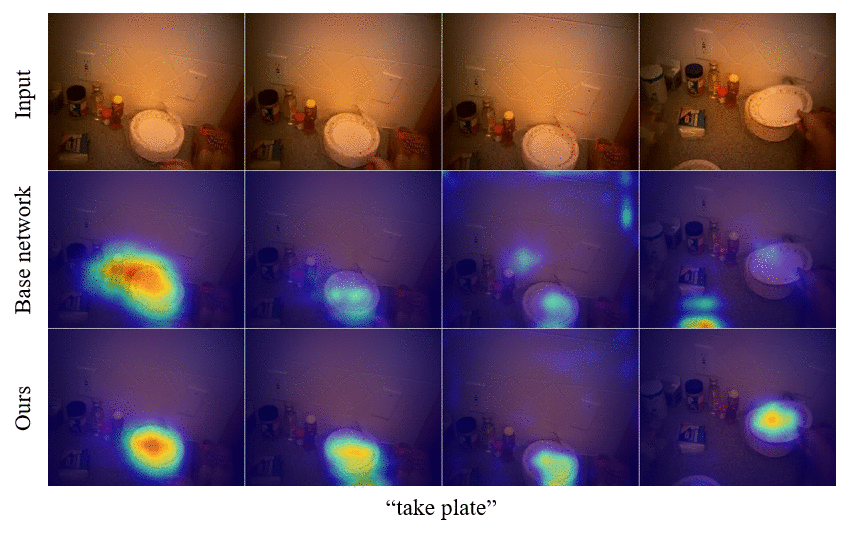

# Gaze-Attention
Integrating Human Gaze into Attention for Egocentric Activity Recognition (WACV 2021)\
[**paper**](https://arxiv.org/abs/2011.03920) | [**presentation**](https://youtu.be/k-VUi54GjXQ)

## Overview
It is well known that human gaze carries significant information about visual attention. In this work, we introduce an effective probabilistic approach to integrate human gaze into spatiotemporal attention for egocentric activity recognition. Specifically, we propose to reformulate the discrete training objective so that it can be optimized using an unbiased gradient estimator. It is empirically shown that our gaze-combined attention mechanism leads to a significant improvement of activity recognition performance on egocentric videos by providing additional cues across space and time.

| Method | Backbone network | Acc(%) | Acc\*(%) |
|:----------------------|:------------------:|:-------:|:-------:|
| [Li et al.](https://openaccess.thecvf.com/content_ECCV_2018/papers/Yin_Li_In_the_Eye_ECCV_2018_paper.pdf) | I3D | 53.30 | - |
| [Sudhakaran et al.](http://bmvc2018.org/contents/papers/0756.pdf) | ResNet34+LSTM | - | 60.76 |
| [LSTA](https://openaccess.thecvf.com/content_CVPR_2019/papers/Sudhakaran_LSTA_Long_Short-Term_Attention_for_Egocentric_Action_Recognition_CVPR_2019_paper.pdf) | ResNet34+LSTM | - | 61.86 |
| [MCN](https://ieeexplore.ieee.org/stamp/stamp.jsp?arnumber=9139335) | I3D | 55.63 | - |
| [Kapidis et al.](https://openaccess.thecvf.com/content_ICCVW_2019/papers/EPIC/Kapidis_Multitask_Learning_to_Improve_Egocentric_Action_Recognition_ICCVW_2019_paper.pdf) | MFNet | 59.44 | 66.59 |
| [Lu et al.](https://openaccess.thecvf.com/content_ICCVW_2019/papers/EPIC/Lu_Learning_Spatiotemporal_Attention_for_Egocentric_Action_Recognition_ICCVW_2019_paper.pdf) | I3D | 60.54 | 68.60 |
| [**Ours**](https://arxiv.org/abs/2011.03920) (reported)  | I3D | **62.84** | **69.58** |
| [**Ours**](https://arxiv.org/abs/2011.03920) (updated)  | I3D | **63.09** | **69.73** |

## Direct Optimization through argmax
[Direct optimization (NeurIPS 2019)](http://papers.neurips.cc/paper/8851-direct-optimization-through-arg-max-for-discrete-variational-auto-encoder.pdf) was originally proposed for learning a variational auto-encoder (VAE) with discrete latent variables. Unlike Gumbel-Softmax reparameterization technique, the direct optimization method introduces an unbiased gradient estimator for the discrete VAE that can be used even under the high-dimensional structured latent spaces. We demonstrate that our problem can be optimized effectively using the direct optimization method.

## Visualization
We use Grad-CAM++ to visualize the spatiotemporal responses of the last convolutional layer to see how the gaze integration affects the top-down attention of the two networks. We can observe that our model is better at attending activity-related objects or regions. Specifically, our model is more sensitive to the target objects.



## Code Usage
First, clone this repository and prepare the EGTEA dataset.
Then, download these four weight files: [i3d\_both\_base.pt](https://drive.google.com/uc?export=download&id=1gRfbOPMS59Ohv5Zul7tLc84WFA1f8-FZ), [i3d\_iga\_best1\_base.pt](https://drive.google.com/uc?export=download&id=1v2j51qwDO3sRv6NTpOCUcai8wbFasgzH), [i3d\_iga\_best1\_gaze.pt](https://drive.google.com/uc?export=download&id=17dAUe3tDeT83Km2Wkuiov6IiZoya45JE), [i3d\_iga\_best1\_attn.pt](https://drive.google.com/uc?export=download&id=1HjR3dOH5JAyPdGjFqwNjKuyMB4aRkAgx).
Finally, put these files in the `weights` folder and just run

`$ python main.py --mode test`

This will reproduce the results reported in the paper.
You can also train the model by running

`$ python main.py --mode train --ngpu 4 --weight weights/i3d_both_base.pt`

## Notes
- We performed all the experiments with Python 3.6 and PyTorch 1.6.0 on 4 GPUs (TITAN Xp).

## Citation
```bibtex
@article{min2020integrating,
  title={Integrating Human Gaze into Attention for Egocentric Activity Recognition},
  author={Min, Kyle and Corso, Jason J},
  journal={arXiv preprint arXiv:2011.03920},
  year={2020}
}
```
